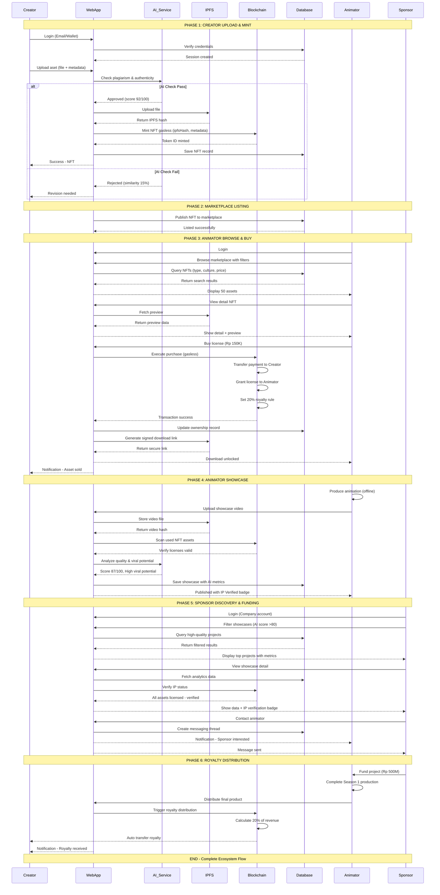

```mermaid
sequenceDiagram
    participant Creator
    participant WebApp
    participant AI_Service
    participant IPFS
    participant Blockchain
    participant Database
    participant Animator
    participant Sponsor
    
    Note over Creator,Sponsor: PHASE 1: CREATOR UPLOAD & MINT
    
    Creator->>WebApp: Login (Email/Wallet)
    WebApp->>Database: Verify credentials
    Database-->>WebApp: Session created
    
    Creator->>WebApp: Upload aset (file + metadata)
    WebApp->>AI_Service: Check plagiarism & authenticity
    
    alt AI Check Pass
        AI_Service-->>WebApp: Approved (score 92/100)
        WebApp->>IPFS: Upload file
        IPFS-->>WebApp: Return IPFS hash
        WebApp->>Blockchain: Mint NFT gasless (ipfsHash, metadata)
        Blockchain-->>WebApp: Token ID minted
        WebApp->>Database: Save NFT record
        WebApp-->>Creator: Success - NFT #1234 live
    else AI Check Fail
        AI_Service-->>WebApp: Rejected (similarity 15%)
        WebApp-->>Creator: Revision needed
    end
    
    Note over Creator,Sponsor: PHASE 2: MARKETPLACE LISTING
    
    WebApp->>Database: Publish NFT to marketplace
    Database-->>WebApp: Listed successfully
    
    Note over Creator,Sponsor: PHASE 3: ANIMATOR BROWSE & BUY
    
    Animator->>WebApp: Login
    Animator->>WebApp: Browse marketplace with filters
    WebApp->>Database: Query NFTs (type, culture, price)
    Database-->>WebApp: Return search results
    WebApp-->>Animator: Display 50 assets
    
    Animator->>WebApp: View detail NFT #1234
    WebApp->>IPFS: Fetch preview
    IPFS-->>WebApp: Return preview data
    WebApp-->>Animator: Show detail + preview
    
    Animator->>WebApp: Buy license (Rp 150K)
    WebApp->>Blockchain: Execute purchase (gasless)
    Blockchain->>Blockchain: Transfer payment to Creator
    Blockchain->>Blockchain: Grant license to Animator
    Blockchain->>Blockchain: Set 20% royalty rule
    Blockchain-->>WebApp: Transaction success
    
    WebApp->>Database: Update ownership record
    WebApp->>IPFS: Generate signed download link
    IPFS-->>WebApp: Return secure link
    WebApp-->>Animator: Download unlocked
    WebApp-->>Creator: Notification - Asset sold
    
    Note over Creator,Sponsor: PHASE 4: ANIMATOR SHOWCASE
    
    Animator->>Animator: Produce animation (offline)
    
    Animator->>WebApp: Upload showcase video
    WebApp->>IPFS: Store video file
    IPFS-->>WebApp: Return video hash
    
    WebApp->>Blockchain: Scan used NFT assets
    Blockchain-->>WebApp: Verify licenses valid
    
    WebApp->>AI_Service: Analyze quality & viral potential
    AI_Service-->>WebApp: Score 87/100, High viral potential
    
    WebApp->>Database: Save showcase with AI metrics
    WebApp-->>Animator: Published with IP Verified badge
    
    Note over Creator,Sponsor: PHASE 5: SPONSOR DISCOVERY & FUNDING
    
    Sponsor->>WebApp: Login (Company account)
    Sponsor->>WebApp: Filter showcases (AI score >80)
    WebApp->>Database: Query high-quality projects
    Database-->>WebApp: Return filtered results
    WebApp-->>Sponsor: Display top projects with metrics
    
    Sponsor->>WebApp: View showcase detail
    WebApp->>Database: Fetch analytics data
    WebApp->>Blockchain: Verify IP status
    Blockchain-->>WebApp: All assets licensed - verified
    WebApp-->>Sponsor: Show data + IP verification badge
    
    Sponsor->>WebApp: Contact animator
    WebApp->>Database: Create messaging thread
    WebApp-->>Animator: Notification - Sponsor interested
    WebApp-->>Sponsor: Message sent
    
    Note over Creator,Sponsor: PHASE 6: ROYALTY DISTRIBUTION
    
    Sponsor->>Animator: Fund project (Rp 500M)
    Animator->>Animator: Complete Season 1 production
    Animator->>WebApp: Distribute final product
    
    WebApp->>Blockchain: Trigger royalty distribution
    Blockchain->>Blockchain: Calculate 20% of revenue
    Blockchain-->>Creator: Auto transfer royalty
    WebApp-->>Creator: Notification - Royalty received
    
    Note over Creator,Sponsor: END - Complete Ecosystem Flow
```
