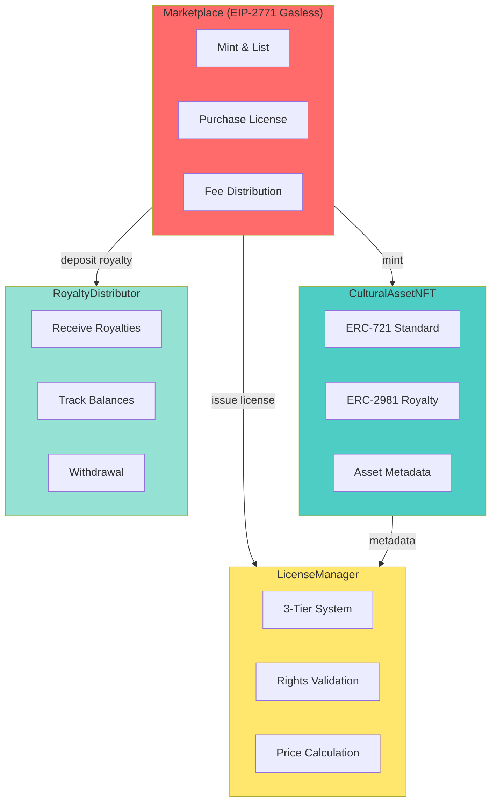

# Bersua Smart Contracts

Infrastruktur blockchain lengkap untuk marketplace NFT animasi budaya Indonesia. Platform ini memungkinkan kreator untuk minting aset budaya sebagai NFT, mengimplementasikan sistem lisensi 3-tier, dan menyediakan distribusi royalti otomatis.

## Arsitektur Sistem



## Daftar Kontrak

### 1. CulturalAssetNFT.sol
Kontrak NFT ERC-721 dengan standar royalti ERC-2981.

**Fitur:**
- Mint aset budaya (Cerita, 3D Model, Musik, Visual 2D)
- Simpan metadata (judul, tipe, budaya, harga, royalti %)
- Standar royalti on-chain ERC-2981
- Proteksi Pausable & ReentrancyGuard
- Hanya marketplace yang bisa mint

**Fungsi Utama:**
```solidity
function mintAsset(
    address creator,
    string memory title,
    AssetType assetType,
    Culture culture,
    uint256 price,
    uint96 royaltyBps,
    string memory uri
) external returns (uint256 tokenId)
```

**AssetType Enum:**
- `CERITA` - Cerita/Naskah (PDF, DOCX)
- `MODEL_3D` - Model 3D (FBX, OBJ, GLB)
- `MUSIK` - Musik (MP3, WAV)
- `VISUAL_2D` - Visual 2D (PNG, SVG)

**Culture Enum:**
- JAWA, SUNDA, BALI, SUMATERA, KALIMANTAN, SULAWESI, PAPUA, NTT, NTB, OTHER

---

### 2. LicenseManager.sol
Mengelola sistem lisensi 3-tier.

**Tier Lisensi:**
| Tier | Harga | Hak Penggunaan | Royalti |
|------|-------|----------------|---------|
| **PERSONAL** | 50% dari harga dasar | Hanya non-komersial | 15% |
| **COMMERCIAL** | 100% dari harga dasar | Komersial penuh, proyek unlimited | 20% |
| **UNLIMITED** | 250% dari harga dasar | Hak jual ulang + modifikasi | 25% |

**Fungsi Utama:**
```solidity
function issueLicense(
    uint256 tokenId,
    address licensee,
    LicenseTier tier,
    uint256 basePrice,
    uint256 amountPaid
) external returns (uint256 licenseId)

function calculateTierPrice(uint256 basePrice, LicenseTier tier) public view returns (uint256)

function hasValidLicense(uint256 tokenId, address licensee, LicenseTier tier) external view returns (bool)

function canUseCommercially(uint256 tokenId, address user) external view returns (bool)

function canResell(uint256 tokenId, address user) external view returns (bool)
```

---

### 3. Marketplace.sol
Marketplace utama dengan dukungan transaksi gasless (EIP-2771).

**Fitur:**
- Mint dan list aset dalam satu transaksi
- Pembelian dengan pemilihan tier
- Distribusi fee dan royalti otomatis
- Dukungan meta-transaksi EIP-2771 (gasless)
- Platform fee (default 2.5%)
- Tracking listing aktif

**Fungsi Utama:**
```solidity
function mintAndList(
    string memory title,
    CulturalAssetNFT.AssetType assetType,
    CulturalAssetNFT.Culture culture,
    uint256 price,
    uint96 royaltyBps,
    string memory uri
) external returns (uint256 tokenId)

function purchaseLicense(uint256 tokenId, LicenseManager.LicenseTier tier) external payable

function getActiveListings() external view returns (uint256[] memory)
```

**Distribusi Pembayaran:**
```
Harga Pembelian (100%)
├─ Platform Fee (2.5%) → Penerima Fee
├─ Royalty (15-25% sesuai tier) → Royalty Distributor
└─ Pembayaran Kreator (sisanya) → Kreator
```

---

### 4. RoyaltyDistributor.sol
Distribusi royalti otomatis kepada kreator.

**Fitur:**
- Terima royalti dari marketplace
- Tracking saldo pending per kreator
- Penarikan kapan saja (minimum 0.001 ETH)
- Riwayat royalti lengkap
- Penarikan darurat oleh owner

**Fungsi Utama:**
```solidity
function depositRoyalty(uint256 tokenId) external payable

function withdrawRoyalties() external

function getPendingRoyalties(address creator) external view returns (uint256)

function getCreatorStats(address creator) external view returns (
    uint256 pending,
    uint256 totalReceived,
    uint256 totalWithdrawn,
    uint256 distributionCount
)
```

---

## Deployment

### Prasyarat
```bash
# Instalasi Foundry
curl -L https://foundry.paradigm.xyz | bash
foundryup

# Instalasi dependencies
forge install
```

### Deploy ke Base Sepolia (Testnet)
```bash
# Set environment variables
export PRIVATE_KEY=your_private_key_here
export BASE_RPC_URL=https://sepolia.base.org

# Deploy semua kontrak
forge script script/Deploy.s.sol:DeployScript \
    --rpc-url $BASE_RPC_URL \
    --broadcast \
    --verify
```

### Deploy ke Base Mainnet
```bash
export BASE_RPC_URL=https://mainnet.base.org

forge script script/Deploy.s.sol:DeployScript \
    --rpc-url $BASE_RPC_URL \
    --broadcast \
    --verify \
    --etherscan-api-key $BASESCAN_API_KEY
```

---

## Testing

### Jalankan Semua Test
```bash
forge test
```

### Jalankan dengan Verbosity
```bash
forge test -vvv
```

### Jalankan Test Spesifik
```bash
forge test --match-test testPurchaseCommercialLicense -vvv
```

### Generate Laporan Coverage
```bash
forge coverage
```

### Hasil Test
```
Ran 7 tests for test/Marketplace.t.sol:MarketplaceTest
[PASS] testCannotPurchaseWithInsufficientFunds()
[PASS] testGetActiveListings()
[PASS] testMintAndList()
[PASS] testMultipleBuyersCanPurchaseDifferentTiers()
[PASS] testPurchaseCommercialLicense()
[PASS] testPurchaseUnlimitedLicense()
[PASS] testRoyaltyPayment()
```

---

## Contoh Penggunaan

### Contoh 1: Mint dan List Aset
```solidity
// Kreator mint model 3D Wayang
marketplace.mintAndList(
    "Wayang Gatot Kaca 3D",
    CulturalAssetNFT.AssetType.MODEL_3D,
    CulturalAssetNFT.Culture.JAWA,
    1 ether,          // Harga dasar
    2000,             // 20% royalti
    "ipfs://Qm..."
);
```

### Contoh 2: Beli Lisensi Commercial
```solidity
// Animator membeli lisensi commercial
uint256 price = marketplace.calculatePurchasePrice(
    tokenId,
    LicenseManager.LicenseTier.COMMERCIAL
);

marketplace.purchaseLicense{value: price}(
    tokenId,
    LicenseManager.LicenseTier.COMMERCIAL
);
```

### Contoh 3: Cek Hak Lisensi
```solidity
// Cek apakah user bisa gunakan secara komersial
bool canUse = licenseManager.canUseCommercially(tokenId, userAddress);

// Cek apakah user bisa jual ulang
bool canResell = licenseManager.canResell(tokenId, userAddress);
```

### Contoh 4: Tarik Royalti
```solidity
// Kreator menarik royalti yang terakumulasi
royaltyDistributor.withdrawRoyalties();
```

---

## Fitur Keamanan

- **ReentrancyGuard** pada semua fungsi payable
- **Pausable** mekanisme emergency stop
- **Ownable** kontrol akses
- **Custom errors** untuk efisiensi gas
- **CEI pattern** (Checks-Effects-Interactions)
- **Safe ETH transfers** dengan penanganan error
- **Input validation** pada semua fungsi eksternal
- **ERC-2771** untuk transaksi gasless

---

## Integrasi Frontend

### Alamat Kontrak (Base Sepolia)
```typescript
export const CONTRACTS = {
  CulturalAssetNFT: "0x...",
  LicenseManager: "0x...",
  Marketplace: "0x...",
  RoyaltyDistributor: "0x..."
}
```

### Contoh dengan wagmi
```typescript
import { useContractWrite } from 'wagmi'
import { CONTRACTS } from './contracts'
import MarketplaceABI from './abis/Marketplace.json'

// Mint dan list aset
const { write: mintAndList } = useContractWrite({
  address: CONTRACTS.Marketplace,
  abi: MarketplaceABI,
  functionName: 'mintAndList',
})

// Beli lisensi
const { write: purchaseLicense } = useContractWrite({
  address: CONTRACTS.Marketplace,
  abi: MarketplaceABI,
  functionName: 'purchaseLicense',
})
```

---

## Optimasi Gas

| Fungsi | Biaya Gas | Optimasi yang Diterapkan |
|--------|-----------|--------------------------|
| `mintAndList` | ~430k | Packed storage, single SSTORE |
| `purchaseLicense` | ~710k | Batch transfers, minimal storage |
| `withdrawRoyalties` | ~50k | Direct transfer, CEI pattern |

**Teknik Optimasi:**
- Custom errors sebagai pengganti revert strings (hemat 50% gas)
- Immutable variables untuk kontrak
- Packed structs
- Minimal state changes
- Batch operations

---

## Path Upgrade

Kontrak saat ini **non-upgradeable** demi keamanan dan kepercayaan. Untuk upgrade di masa depan:

1. Deploy versi kontrak baru
2. Migrasi data jika diperlukan
3. Update frontend untuk menggunakan alamat baru

**Pertimbangan:** Implementasi proxy pattern (UUPS/Transparent) di v2 jika upgrade critical.

---

## Lisensi

MIT License - Lihat file LICENSE

---

## Kontribusi

1. Fork repository
2. Buat feature branch
3. Tulis test untuk fitur baru
4. Pastikan semua test pass: `forge test`
5. Submit pull request

---

## Dukungan

- **Dokumentasi:** https://docs.bersua.id
- **GitHub Issues:** https://github.com/bersua/smart-contracts/issues
- **Discord:** https://discord.gg/bersua

---

## Status Audit

- Internal security review: Selesai
- External audit: Pending
- Bug bounty program: Planned

**Kontak Keamanan:** security@bersua.id

---

Dibuat untuk Warisan Budaya Indonesia